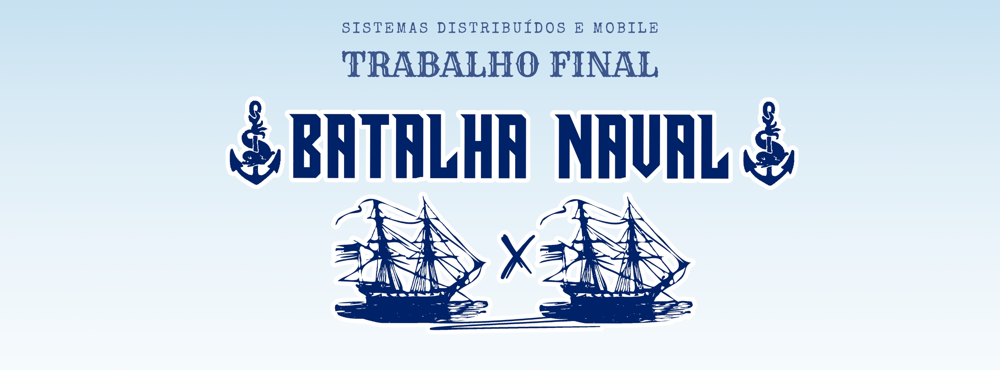

<p align="center">
   
</p>

# 🛳️ Batalha Naval Multiplayer

Este é um jogo multiplayer de Batalha Naval, desenvolvido com **React** no front-end e **Flask + Socket.IO** no back-end. O projeto conta com funcionalidades em tempo real, posicionamento de navios, alternância de turnos e reconexão de estado.

## 🚀 Tecnologias Utilizadas

* React (Front-end)
* Flask (Back-end)
* Flask-SocketIO (Comunicação em tempo real)
* Flask-CORS (Permissões entre origens)
* SQLite (Banco de dados leve)
* SweetAlert2 (Alertas visuais)

## 🧠 Funcionalidades

* ✅ Multiplayer em tempo real via sockets
* ✅ Posicionamento visual dos navios
* ✅ Controle de vez (turnos alternados)
* ✅ Persistência dos dados mesmo após recarregar a página
* ✅ Sistema de reinício de partida com confirmação entre os jogadores

> ⚠️ O sistema de placar histórico está em desenvolvimento e poderá ser aprimorado em versões futuras.

## 🎮 Como Rodar Localmente

### Requisitos

**Backend (Python):**

```bash
pip install flask
pip install flask_cors
pip install flask_socketio
pip install flask_sqlalchemy
```

**Frontend (Node.js):**

```bash
npm install
```

> Certifique-se de ter Python e Node.js instalados no seu sistema.

---

## 🔧 Passo a Passo para Rodar

Abra **três terminais**:

### Terminal 1 – Servidor Mestre (Flask)

```bash
cd servidor_mestre
python server_mestre.py
```

### Terminal 2 – Jogador 1 (React)

```bash
npm install
npm start
```

### Terminal 3 – Jogador 2 (React em outra porta)

```bash
set PORT=3001
npm start
```

> ⚠️ É essencial rodar o segundo jogador em outra porta (3001).

---

## 🤝 Contribuindo

Sinta-se à vontade para abrir *issues* com melhorias ou relatar bugs.

## 📌 Melhorias Futuras

* Placar histórico completo e confiável
* Tela de início com nomes dos jogadores e histórico
* Sons e animações visuais durante os ataques
* Melhoria na interface para dispositivos móveis


